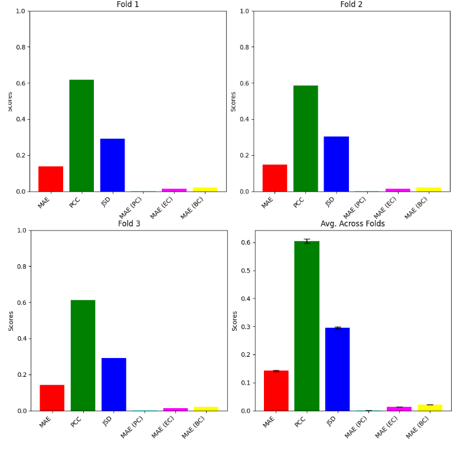
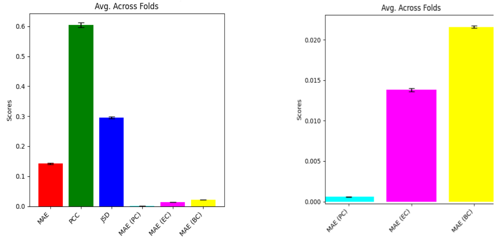
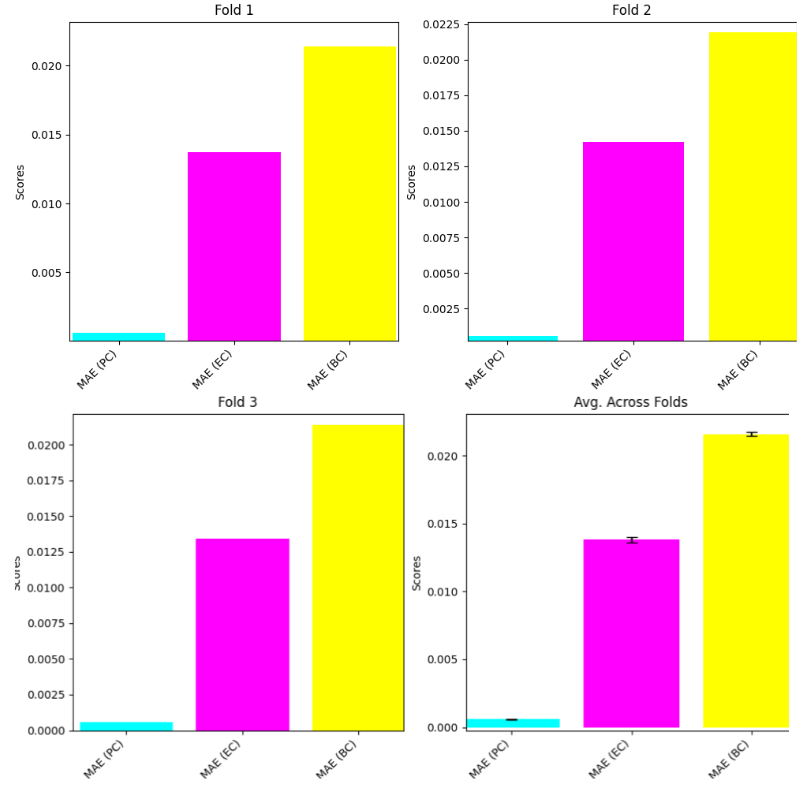

# DGL2024 Brain Graph Super-Resolution Challenge

## Contributors

Team Graphite

Naman Sharma,
Elijah Ahmad,
Shiv Bhatia,
Ioana Mihailescu,
Filippo Varini 


## Problem Description

The key objective of this Kaggle competition was to perform graph super-resolution by increasing the number of nodes in an input brain connectivity graph and producing an updated brain connectivity matrix. We understood the importance of this task from a medical imaging perspective where scanners may have varying resolutions and high demand/backlog for scanners preventing technicians from taking slow, high-resolution scans. Hence by collating a dataset of low and high-resolution brain graphs per patient, we can mitigate these issues by building graph-based models to perform super-resolution. The key research question was to determine how well and through what approach can super-resolution be best achieved. 

## GraphITE - Methodology

Our GraphITE (Graph Imaging
Technology for Encephalograph) model builds off GSR-NET[1] but incorporates various key changes (motivated in our report and presentation): data augmentation by injecting Gaussian noise with a specified hyperparameter for noise variance, improved aggregation through separate self-connections (i.e. an extra set of learnable params - see below equation), a topological loss function computed as the mean absolute error between node degrees, and the initialization of the feature matrix with a noisy adjacency matrix while avoiding the use of identity or manual feature matrices.


## Used External Libraries

Please create a venv from the `requirements.txt` and run the `run_final_model.ipynb` to see the trained model we submitted to Kaggle.
To see the 3F-CF and the produced topological measures bar plots, run `run_cv_model.py`.

To run the memory profiler run:
```
    mprof run --multiprocess run_cv_model.py 
    mprof plot
```
## Predictions CSV
The required predictions CSV can be found under submission-csvs, in files `predictions_fold_{fold_num}.csv` where `fold_num` takes values 0 to 2. We also submitted the pickled trained cross validation models in `fold{fold_num}_model.sav` and the final Kaggle submission model under `final-model.sav`. You can load them using `pickle.load({model_name})`.

## Results






## References

[1]: {GSR-Net} Megi Isallari and Islem Rekik, "GSR-Net: Graph Super-Resolution Network for Predicting High-Resolution from Low-Resolution Functional Brain Connectomes," in \textit{Machine Learning in Medical Imaging: 11th International Workshop, MLMI 2020, Held in Conjunction with MICCAI 2020, Lima, Peru, October 4, 2020, Proceedings}, Berlin, Heidelberg, Springer-Verlag, 2020, pp. 139–149. 
